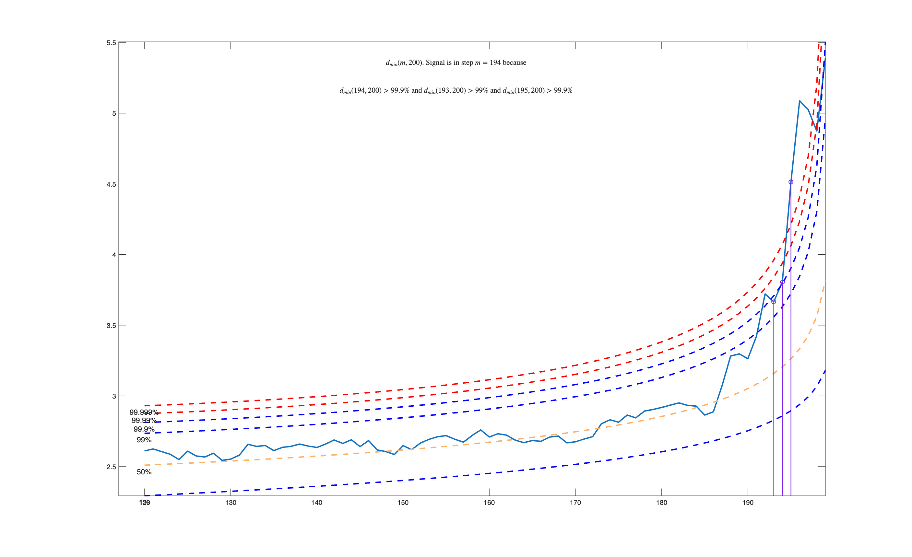
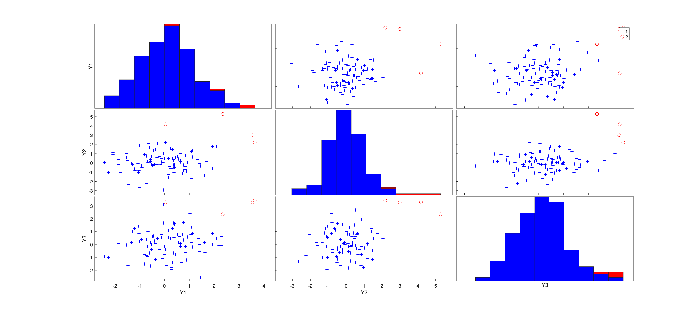

# FSM

Detects multivariate outliers by growing a clean subset one observation at a
time and watching the distance to the nearest excluded point jump.

## Input arguments

Mandatory:

| Argument | Type | Description |
|---|---|---|
| `Y` | `Matrix{Float64}` | `n x v` data matrix |

Optional, passed as name-value keywords:

| Argument | Description |
|---|---|
| `msg` | set to 0 to silence progress messages |
| `plots` | set to 0 for no plot |
| `init` | subset size at which monitoring starts |

Without `msg = 0` this prints a long block of signal detection diagnostics.

## Output arguments

| Value | Type | Description |
|---|---|---|
| `outliers` | `Matrix{Float64}` | the units flagged |
| `loc` | `Matrix{Float64}` | `1 x v` centre from the clean units only |
| `mmd` | `Matrix{Float64}` | minimum Mahalanobis distance at each step |

## Example

```julia
using FSDA
using Random
using Printf

# The same data as the mcd example, so the two can be compared.
Random.seed!(123456)
n, v = 200, 3
Y = randn(n, v)
Ycont = copy(Y)
Ycont[1:5, :] .+= 3

call("rng", 1234, nargout = 0)

out = FSM(Ycont; msg = 0, plots = 0)

flagged = sort(Int.(vec(out["outliers"])))
@printf("units flagged as outliers: %d of %d\n", length(flagged), n)
println("flagged units: ", flagged)

stop_engine()
```

## Output

```
units flagged as outliers: 4 of 200
flagged units: [1, 2, 3, 5]
```

A `Dict` with `outliers`, the units flagged, `loc`, the centre computed from
the clean units only, and `mmd`, the minimum Mahalanobis distance at each step.

FSM finds four of the five planted units and misses unit 4, while mcd on the
same data finds all five. Neither is wrong; they judge outlyingness
differently and can disagree on a borderline point.

The minimum Mahalanobis distance at each step against its confidence envelopes. The signal is detected at step 194.



Each pair of variables plotted against each other, with histograms on the diagonal. The flagged units are shown in red.



## See also

- FSM documentation: <https://rosa.unipr.it/FSDA/FSM.html>
- FSDA datasets information: <https://rosa.unipr.it/FSDA/datasets_mv.html>
