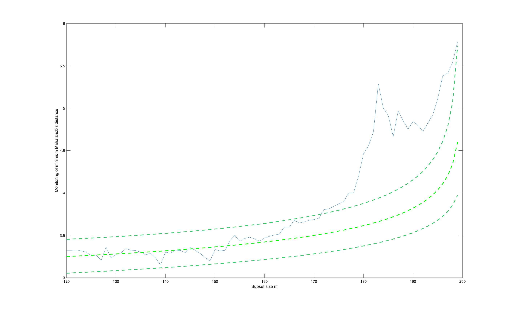

# FSMeda

Runs the same forward search as FSM but records diagnostics at every step, so
the search can be inspected rather than simply trusted.

## Input arguments

Mandatory:

| Argument | Type | Description |
|---|---|---|
| `Y` | `Matrix{Float64}` | `n x v` data matrix |
| `bsb` | `Matrix{Float64}` | the starting subset, a column of unit numbers |

Optional, passed as name-value keywords:

| Argument | Description |
|---|---|
| `plots` | set to 0 for no plot |
| `init` | subset size at which monitoring starts |

FSDA begins monitoring from its own minimum subset size, which may be larger
than the subset you supply, so the first reported step can already be well
into the search.

## Output arguments

| Value | Type | Description |
|---|---|---|
| `mmd` | `Matrix{Float64}` | two columns: subset size, and the minimum Mahalanobis distance at that step |
| `MAL` | `Matrix{Float64}` | distance of every unit at every step |

## Example

```julia
using FSDA
using Printf

Y = eval_expr("table2array(getfield(load('swiss_banknotes.mat'),'swiss_banknotes'))")

# The search needs a clean start. unibiv scores every unit, and the lowest
# scoring ones are the most ordinary.
fre = unibiv(Y)
bsb = reshape(fre[sortperm(fre[:, 4])[1:20], 1], :, 1)

out = FSMeda(Y, bsb; plots = 0)

mmd = out["mmd"]

for i in vcat(1:3, (size(mmd, 1) - 2):size(mmd, 1))
    @printf("  subset size %3d   mmd = %7.4f\n", Int(mmd[i, 1]), mmd[i, 2])
end

stop_engine()
```

## Output

```
  subset size 120   mmd =  3.3228
  subset size 121   mmd =  3.3230
  subset size 122   mmd =  3.3280
  subset size 197   mmd =  5.4130
  subset size 198   mmd =  5.5387
  subset size 199   mmd =  5.7836
```

A `Dict` whose `mmd` field has two columns, the subset size and the minimum
Mahalanobis distance at that step, and whose `MAL` field holds the distance
of every unit at every step.

The distance is flat near 3.3 through the early steps and climbs to 5.8 by
the end. Early on the search adds notes that sit comfortably with those
already in; by the end the only notes left are unlike the rest.

The minimum Mahalanobis distance at each step, with its confidence envelopes.



## See also

- FSMeda documentation: <https://rosa.unipr.it/FSDA/FSMeda.html>
- FSDA datasets information: <https://rosa.unipr.it/FSDA/datasets_mv.html>
