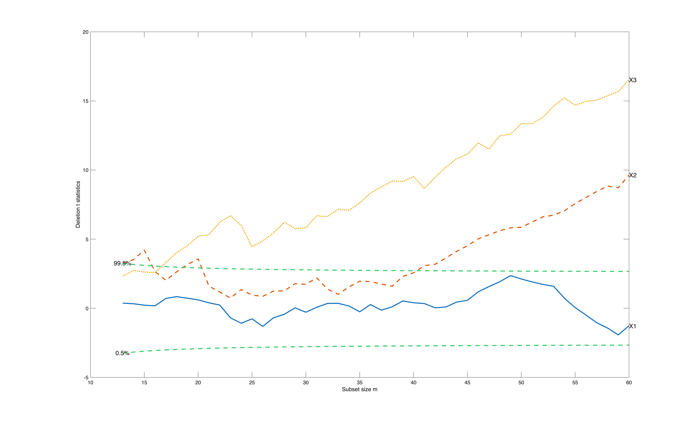

# FSRaddt

Runs an added t test for every predictor at every step of the forward search.
A predictor that is significant only at some steps is one whose importance
depends on which observations are included.

## Input arguments

Mandatory:

| Argument | Type | Description |
|---|---|---|
| `y` | `Matrix{Float64}` | `n x 1` response column |
| `X` | `Matrix{Float64}` | `n x (p-1)` predictors; the intercept is added by default |

Optional, passed as name-value keywords:

| Argument | Description |
|---|---|
| `msg` | set to 0 to silence progress messages |
| `plots` | set to 0 for no plot |
| `quant` | quantiles of the envelopes to superimpose |

Use `D[:, 4:4]` rather than `D[:, 4]`, so the response stays two dimensional.

## Output arguments

| Value | Type | Description |
|---|---|---|
| `Tdel` | `Matrix{Float64}` | `steps x (1 + p-1)`: subset size, then one deletion t statistic per predictor |

## Example

```julia
using FSDA
using Printf

D = eval_expr("table2array(getfield(load('multiple_regression.mat'),'multiple_regression'))")

y = D[:, 4:4]
X = D[:, 1:3]

# FSRaddt subsamples, so seed MATLAB or the search differs between runs.
call("rng", 1234, nargout = 0)

out = FSRaddt(y, X; msg = 0, plots = 0)

Tdel   = out["Tdel"]
nsteps = size(Tdel, 1)
npred  = size(Tdel, 2) - 1

for j in 1:npred
    cnt = count(>(2), abs.(Tdel[:, j + 1]))
    @printf("  X%-2d  significant at %3d of %d steps\n", j, cnt, nsteps)
end

stop_engine()
```

## Output

```
  X1   significant at   2 of 48 steps
  X2   significant at  31 of 48 steps
  X3   significant at  48 of 48 steps
```

A `Dict` whose `Tdel` field is `steps x (1 + p-1)`: the subset size followed by
one deletion t statistic per predictor. Roughly, an absolute value above 2 is
significant at the usual 5 percent level.

Here X3 matters at every step, X1 at almost none, and X2 only once certain
observations are in. A plain t test on the full sample would hide that.

The deletion t statistic for each predictor, monitored along the search.



## See also

- FSRaddt documentation: <https://rosa.unipr.it/FSDA/FSRaddt.html>
- FSDA datasets information: <https://rosa.unipr.it/FSDA/datasets_regression.html>
