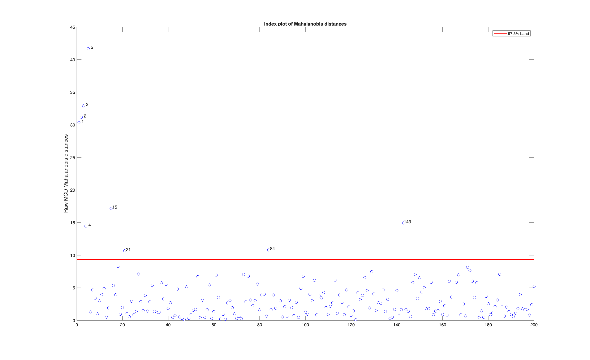
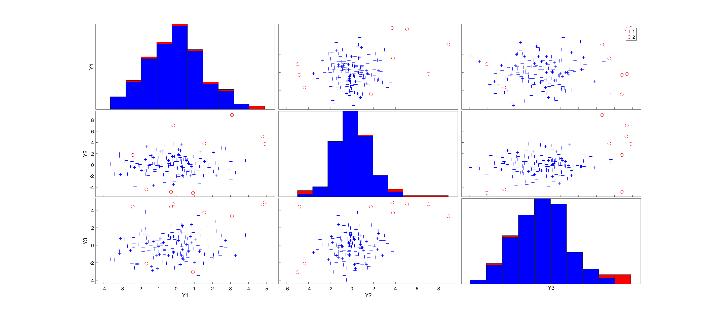

# mcd

Finds the centre and spread of the tightest half of the data, so contamination
cannot inflate the estimate and hide inside it.

## Input arguments

Mandatory:

| Argument | Type | Description |
|---|---|---|
| `Y` | `Matrix{Float64}` | `n x v` data matrix |

Optional, passed as name-value keywords:

| Argument | Description |
|---|---|
| `msg` | set to 0 to silence progress messages |
| `plots` | set to 0 for no plot |

## Output arguments

| Value | Type | Description |
|---|---|---|
| `loc` | `Matrix{Float64}` | `1 x v` robust centre |
| `cov` | `Matrix{Float64}` | `v x v` robust covariance |
| `md` | `Matrix{Float64}` | `n x 1` distance of each unit from that centre |
| `outliers` | `Matrix{Float64}` | the units judged too far away |

## Example

```julia
using FSDA
using Random
using Printf

# 200 points in 3 dimensions, with the first five shifted well away.
Random.seed!(123456)
n, v = 200, 3
Y = randn(n, v)
Ycont = copy(Y)
Ycont[1:5, :] .+= 3

# MCD tries many random subsets, so seed MATLAB for a repeatable answer.
call("rng", 1234, nargout = 0)

out = mcd(Ycont; msg = 0, plots = 0)

flagged = sort(Int.(vec(out["outliers"])))
@printf("units flagged as outliers: %d of %d\n", length(flagged), n)
println("flagged units: ", flagged)

stop_engine()
```

## Output

```
units flagged as outliers: 9 of 200
flagged units: [1, 2, 3, 4, 5, 15, 21, 84, 143]
```

A `Dict` with `loc`, the robust centre, `cov`, the robust covariance, `md`, the
distance of each unit from that centre, and `outliers`, the units judged too
far away.

The five planted points are all found. The others are ordinary points near the
edge of the cloud; with 200 random points a few always fall there.

Each unit's distance from the robust centre, plotted against its index. The red line is the 97.5 percent band, and the units above it are labelled.



FSDA also opens this figure, which is left empty.


Each pair of variables plotted against each other, with histograms on the diagonal. The units flagged by the raw estimate are shown in red.



The same scatter matrix after reweighting.


The scatter matrix on the same axes as the original data.


## See also

- mcd documentation: <https://rosa.unipr.it/FSDA/mcd.html>
- FSDA datasets information: <https://rosa.unipr.it/FSDA/datasets_mv.html>
