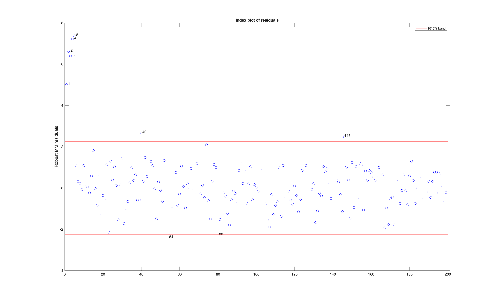

# MMreg

Starts from a high breakdown estimate and refines it, so the fit resists
outliers without losing much of the precision of least squares.

## Input arguments

Mandatory:

| Argument | Type | Description |
|---|---|---|
| `y` | `Matrix{Float64}` | `n x 1` response column |
| `X` | `Matrix{Float64}` | `n x (p-1)` predictors; the intercept is added by default |

Optional, passed as name-value keywords:

| Argument | Description |
|---|---|
| `Srhofunc` | which rho function the initial S estimate uses |
| `InitialEst` | supply your own starting estimate |
| `Snsamp` | how many subsamples the S estimate draws |

MMreg prints an estimated running time for the S estimate. There is no msg
option to silence it.

## Output arguments

| Value | Type | Description |
|---|---|---|
| `beta` | `Matrix{Float64}` | the final coefficients |
| `Sbeta` | `Matrix{Float64}` | the initial S estimate they were refined from |
| `outliers` | `Matrix{Float64}` | the units flagged |

## Example

```julia
using FSDA
using Random
using Printf

# The same data as the LXS and FSR examples.
Random.seed!(123456)
n, p = 200, 3
X = randn(n, p)
y = randn(n, 1)
ycont = copy(y)
ycont[1:5] .+= 6

call("rng", 1234, nargout = 0)

out = MMreg(ycont, X)

beta  = vec(out["beta"])
Sbeta = vec(out["Sbeta"])

for j in 1:length(beta)
    @printf("  S estimate %10.6f   MM final %10.6f\n", Sbeta[j], beta[j])
end

println("flagged units: ", sort(Int.(vec(out["outliers"]))))

stop_engine()
```

## Output

```
  S estimate  -0.111755   MM final  -0.145626
  S estimate   0.088861   MM final   0.081873
  S estimate  -0.101722   MM final  -0.119002
  S estimate   0.163946   MM final   0.138894
flagged units: [1, 2, 3, 4, 5, 40, 54, 80, 146]
```

A `Dict` with `beta`, the final coefficients, `Sbeta`, the initial S estimate
they were refined from, and `outliers`, the units flagged.

The changes from S to MM are in the third decimal place. The starting estimate
was already close to the zero it should be, so refinement adjusts it rather
than rescuing it. The second stage buys precision, not a different answer.

On the same data LXS flags units 1 to 5 plus 40 and 146. MMreg finds all of
those and adds 54 and 80, so the two agree on the planted outliers and differ
only on borderline cases.

The residuals from the MM estimate, with the flagged units marked.



## See also

- MMreg documentation: <https://rosa.unipr.it/FSDA/MMreg.html>
- FSDA datasets information: <https://rosa.unipr.it/FSDA/datasets_regression.html>
