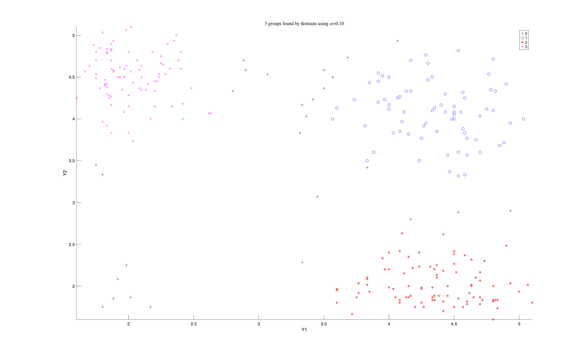

# tkmeans

Trimmed k-means: clusters the data while setting aside a fixed share of it as
noise, instead of forcing every point into a cluster.

## Input arguments

Mandatory:

| Argument | Type | Description |
|---|---|---|
| `Y` | `Matrix{Float64}` | `n x v` data matrix |
| `k` | `Int` | how many clusters to look for |
| `alpha` | `Float64` | proportion of units to set aside as noise |

Optional, passed as name-value keywords:

| Argument | Description |
|---|---|
| `msg` | set to 0 to silence progress messages |
| `plots` | set to 0 for no plot |
| `weights` | set to 1 to weight clusters by size |

## Output arguments

| Value | Type | Description |
|---|---|---|
| `idx` | `Matrix{Float64}` | cluster label per unit, 0 meaning trimmed |
| `muopt` | `Matrix{Float64}` | `k x v`, one centroid per row |

## Example

```julia
using FSDA
using Printf

Y = eval_expr("table2array(getfield(load('geyser2.mat'),'geyser2'))")
n = size(Y, 1)

k     = 3      # look for three clusters
alpha = 0.1    # set aside 10 percent as noise, matching the tclust example

# tkmeans starts from random subsets, so seed MATLAB for a repeatable answer.
call("rng", 1234, nargout = 0)

out = tkmeans(Y, k, alpha; msg = 0, plots = 0)

idx = Int.(vec(out["idx"]))     # 0 means trimmed
mu  = out["muopt"]

for c in 1:k
    @printf("  cluster %d  %4d eruptions  centroid %8.2f %8.2f\n",
            c, count(==(c), idx), mu[c, 1], mu[c, 2])
end

stop_engine()
```

## Output

```
  cluster 1    71 eruptions  centroid     4.35     4.08
  cluster 2    87 eruptions  centroid     4.35     2.01
  cluster 3    86 eruptions  centroid     2.02     4.50
```

A `Dict` in which `idx` gives the cluster label of every unit, with 0 meaning
the unit was trimmed, and `muopt` holds one centroid per row.

The tclust example runs on this same data, trimming the same 10 percent, and
its centroids agree with these to within 0.06 on every one. tclust can model
each cluster's shape and tkmeans cannot, but these clusters are roughly round
and similarly sized, so the extra flexibility buys nothing here. It would
matter on data with elongated or very unequal clusters.

The three clusters found, each in its own colour, with the trimmed units shown as black crosses.



## See also

- tkmeans documentation: <https://rosa.unipr.it/FSDA/tkmeans.html>
- FSDA datasets information: <https://rosa.unipr.it/FSDA/datasets_clu.html>
